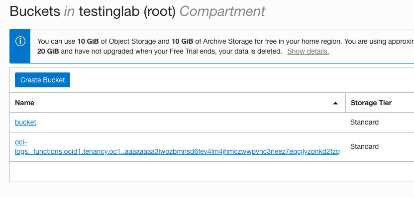
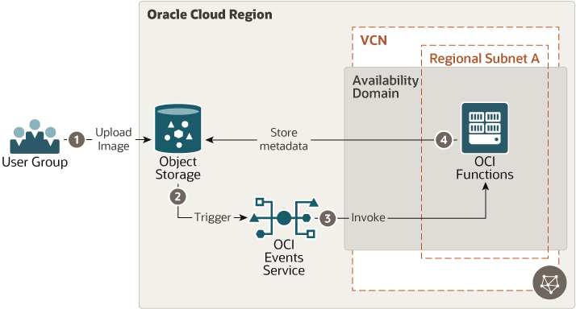

# oci-arch-fn-app

Oracle Functions is a serverless, highly scalable, fully managed platform built on Oracle Cloud Infrastructure and powered by the Fn Project open source engine. Developers can use it to write and deploy code that delivers business value without worrying about provisioning or managing the underlying infrastructure. Oracle Functions is container-native with functions packaged as Docker container images.

## Terraform Provider for Oracle Cloud Infrastructure
The OCI Terraform Provider is now available for automatic download through the Terraform Provider Registry. 
For more information on how to get started view the [documentation](https://www.terraform.io/docs/providers/oci/index.html) 
and [setup guide](https://www.terraform.io/docs/providers/oci/guides/version-3-upgrade.html).

* [Documentation](https://www.terraform.io/docs/providers/oci/index.html)
* [OCI forums](https://cloudcustomerconnect.oracle.com/resources/9c8fa8f96f/summary)
* [Github issues](https://github.com/terraform-providers/terraform-provider-oci/issues)
* [Troubleshooting](https://www.terraform.io/docs/providers/oci/guides/guides/troubleshooting.html)

## Clone the Module
Now, you'll want a local copy of this repo. You can make that with the commands:

    git clone https://github.com/oracle-quickstart/oci-arch-fn-app.git
    cd oci-arch-fn-app
    ls

## Prerequisites
First off, you'll need to do some pre-deploy setup.  That's all detailed [here](https://github.com/cloud-partners/oci-prerequisites).

Secondly, create a `terraform.tfvars` file and populate with the following information:

```
# Authentication
tenancy_ocid         = "<tenancy_ocid>"
user_ocid            = "<user_ocid>"
fingerprint          = "<finger_print>"
private_key_path     = "<pem_private_key_path>"

# SSH Keys
ssh_public_key  = "<public_ssh_key_path>"

# Region
region = "<oci_region>"

# Compartment
compartment_ocid = "<compartment_ocid>"

````

Deploy:

    terraform init
    terraform plan
    terraform apply


## Post-Deployment Setup

### Step 1: Configure OCI-CLI

Go to OCI console -> Compute -> Instances.

You should be able to see the instance `function-instance`

Copy the public-ip of the instance. ssh into the instance using below command

`ssh -i <path-to-ssh-private-key> opc@<public-ip-of-function-instance>`

once you are logged in, make sure oci-cli is installed using 

`oci -v`

Next, run the command `oci setup config`

Press `Enter` when prompted for a location for config file.

Press `Enter` when prompted for directory name to accept the default.

Enter the details about user OCID, tenancy OCID and region.

Enter `Y` for `New RSA key pair`. 

Press Enter and accept default options for directories for keys and name for the keys. 

Press Enter when prompted for passphrase so as to leave it blank.

Verify all the files exists by checking in -> `cd /home/opc/.oci` and then `ls`.

You should see these files.


Run `cat config` and make sure all the details about tenancy are correct.

Now, do `cat oci_api_key_public.pem` and copy the contents of the file. 

Login to OCI console, go to your profile and then your username. 

Click on `Add Public Key` and paste the contents of the file copied in last step. 

Make sure the `fingerprint` is generated and also check it is same as the one in Jenkins Instance `/home/opc/.oci/config` file. 

We are done.

### Step 2: Add user to group

Go to OCI console -> Identity -> Groups.

You should be able to see the group `faas-group`

Click on `Add User to Group` at bottom. This opens up a new window.

Choose your username from the dropdown and add it.

### Step 3: Generate OCIR token

Login to OCI console.

Click on your `Profile` -> `User Settings`. On the bottom left, click on `Auth Tokens`. Click on `Generate Token`.

Provide a discription and then hit `Generate Token`. This will generate a token. Make sure to copy the token and save it for future steps.

## Step 4: Run function commands

Log in to instance `ssh -i <path-to-ssh-private-key> opc@<public-ip-of-function-instance>`

Run the below commands one after another. Make sure to edit the values when necessery.

`fn create context my-context --provider oracle`
`fn use context my-context`
`fn update context oracle.compartment-id "<COMPARTMENT-OCID>"`
`fn update context api-url https://functions.us-ashburn-1.oraclecloud.com`
`fn update context registry iad.ocir.io/<OCI_NAMESPACE>/acme-repo`
`fn update context oracle.profile DEFAULT`
`fn init --runtime java cloud-events-demo-fn`

## Step 5: Update the code and deploy the function

On the logged instance, do `ls` and now you should see the folder `cloud-events-demo-fn` that contains a boiler template code.

Lets delete the test code for now.

Run -> `rm /home/opc/cloud-events-demo-fn/src/test/java/com/example/fn/HelloFunctionTest.java`

Next, cd into the folder -> `cd cloud-events-demo-fn`

Edit the `pom.xml` and `/home/opc/cloud-events-demo-fn/src/main/java/com/example/fn/HelloFunction.java` file. 

Go to below links and copy the content for the corresponding files and replace them in `pom.xml` and `HelloFunction.java` files on `function-instance`. 

`https://gist.github.com/KartikShrikantHegde/15211d081629fb33af3e4f23e9cb89bd`

`https://gist.github.com/KartikShrikantHegde/f73247396db15e93f0abbda723c07bc7`

*** Imp Note ***

Before we deploy the function, type `exit` from function-instance and ssh back in.

Now, its time to deploy the function.

`docker login iad.ocir.io`

Enter the username and password when asked.

<Username> -> <your-tenancy-namespace>/oracleidentitycloudservice/<your-oci-user-email-here> (look for namespace in tenancy details on your OCI console for <your-tenancy-namespace>)

<Password> -> OCIR token we had created in Step 3

Start the docker service

`sudo systemctl start docker`

Next do, `cd cloud-events-demo-fn`

Now deploy the function using below commands.

`fn --verbose deploy --app cloud-events-demo`

## Step 6: Create an event service and object storage bucket

Login to OCI console. 

Click on `Object Storage` on the left side bar, create a bucket named `bucket` and make sure to enable `emit events` as shown below.


Next, To create a new cloud event rule, click on `Application Integration` -> `Events Service` in the sidebar menu.

Click on 'Create Rule' and populate the form as shown below.


Also, go to created function `cloud-events-demo` and make sure to enable the logs as shown below on OCI console.


## Step 7: Invoking the function

To the object storage bucket we just created named `bucket`, upload a sample image.

## Step 8: Verification

The uploaded image triggers the event, which invokes the function. The logs of the metadata about the object are written to object storage. Wait for ~15 mins for the logs to appear in the object storage.

You can see the logs in a new bucket as shown below and also download it if needed.



## Destroy the Deployment
When you no longer need the deployment, you can run this command to destroy it:

    terraform destroy

## Serverless Architecture




## Reference Archirecture

- [Deploy an event-triggered serverless application](https://docs.oracle.com/en/solutions/event-triggered-serverless-app/index.html)
